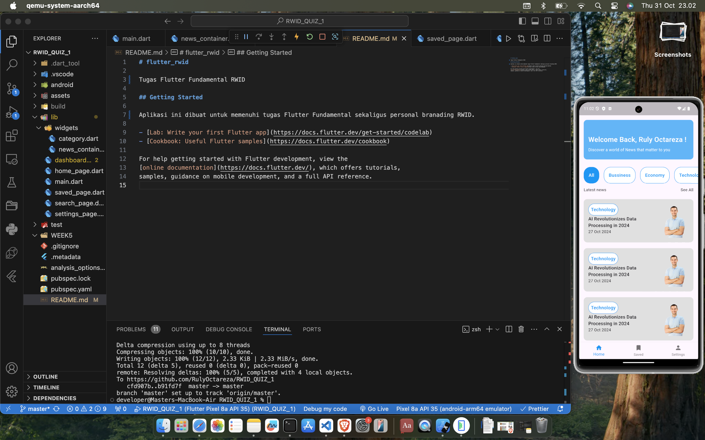
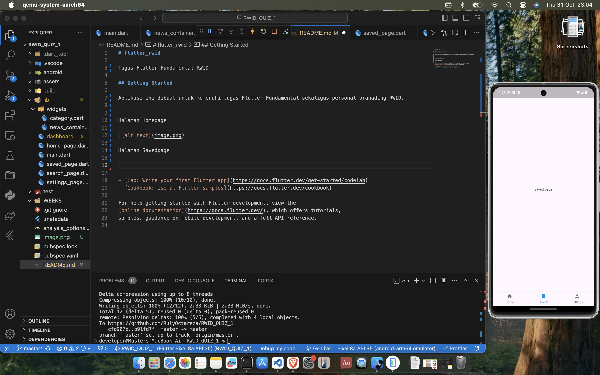
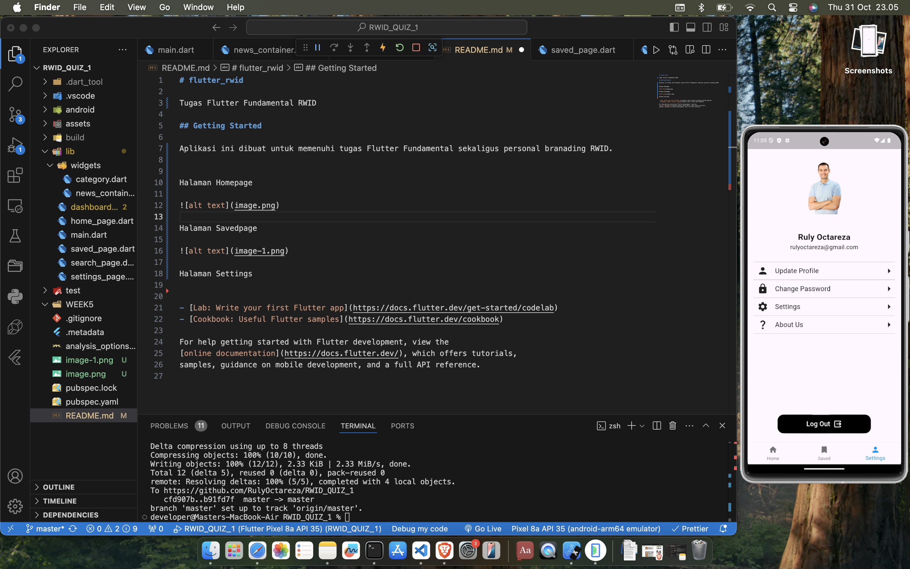
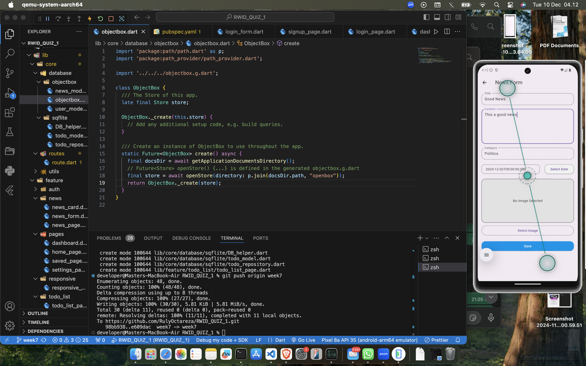
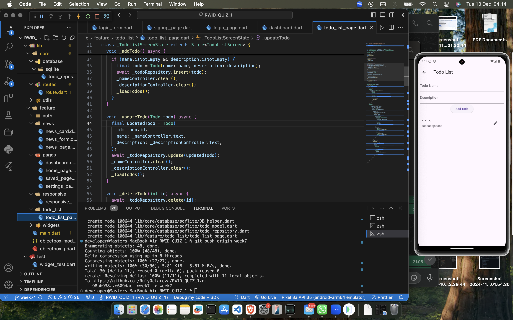

# flutter_rwid

Tugas Flutter Fundamental RWID

## Getting Started

Aplikasi ini dibuat untuk memenuhi tugas Flutter Fundamental sekaligus personal branading RWID.

Halaman Homepage

Halaman Savedpage

Halaman Settings

Halaman Create new News with ObjectBox Database

Halaman Todo List with Sqflite Database

- [Lab: Write your first Flutter app](https://docs.flutter.dev/get-started/codelab)
- [Cookbook: Useful Flutter samples](https://docs.flutter.dev/cookbook)

For help getting started with Flutter development, view the
[online documentation](https://docs.flutter.dev/), which offers tutorials,
samples, guidance on mobile development, and a full API reference.
